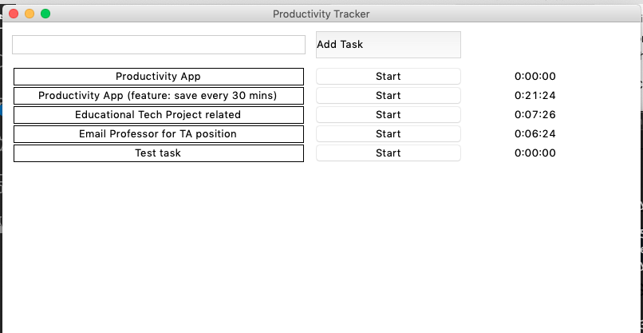
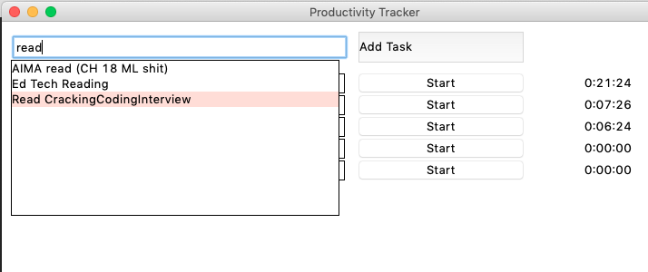
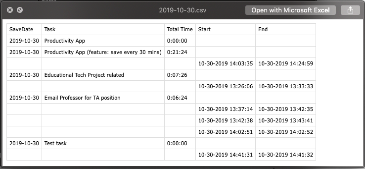

# Productivity / Activity Tracker

Simple GUI Python app to help keep track of what you work on and for how long
Application can be exited at the end of the day and saves tasks to CSV

Created by: Haard Shah

## Running

```bash
python3 <path-to-file>/app.py
```

## Sample

Application


Autocomplete


Persistent (stores tasks in CSV)


## Modules used
- `humanize=0.5.1`

> default Python packages
- `tkinter`
- `datetime`
- `os`
- `csv`

## Next

- Add colors / Prettify everything
- Ability to delete tasks from current session
- Ability to VOID current running task
- Scroll (autocomplete listbox in `AutocompleteEntry.py`)
- Scroll (main window if there are too many tasks)